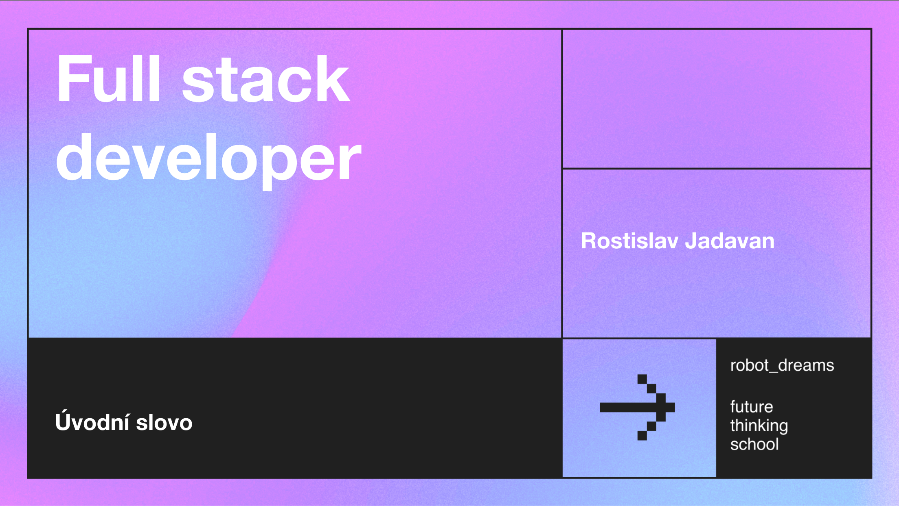

## Robot Dreams

Public repo to store all of my projects from Full-Stack Developer course by Robot Dreams.

—> [Robot Dreams](https://robotdreams.cz/course/95-full-stack-developer)



__Výstup z kurzu:__
-->[FullStack Web App](git@github.com:nightguarder/DreamBlogger.git)

# Program

## Full Stack Developer: První krůčky a nástroje [Repo](https://github.com/nightguarder/FullDevLekce1.git)

—> Co by měl umět full stack developer?
—> MPA (Multi-page application) vs. SPA (Single-page application)
—> Přehled populárních back-end jazyků
 
- [x] Úkol: Instalace node.js a nastavení IDE pro javascript vývoj a instalace frameworku Express.js a vytvoření web serveru.

## Lekce 2  Čtvrtek 30.11. 2023 [Repo](https://github.com/nightguarder/FullDevLekce2.git)
Jak postavit back-end aplikaci

—> Co je web server?
—> Jak funguje HTTP protokol
—> Vícevrstvá architektura
 
- [x] Úkol: Vytvoření adresářové struktury pro aplikaci dle zadání.

## Lekce 3 Úterý 5. 12. 2023 [Repo](https://github.com/nightguarder/FullDevLekce3.git)
Jak vymodelovat funkční API

—> Co je REST API?
—> Jak modelovat API
—> Různé přístupy (Github API vs. Slack API)
—> OpenAPI
 
- [x] Úkol: Návrh API endpointů pro aplikaci dle zadání.
 
## Lekce 4 Čtvrtek 7. 12. 2023 [Repo](https://github.com/nightguarder/FullDevLekce4.git)
 Autentizace a autorizace: Best practices

—> Co je autentizace a co autorizace?
—> Typy autentizace a jejich použití
—> Token-based autentizace detailně
—> Role-based autorizace
 
- [x] Úkol: JWT token Auth.
  
## Lekce 5 Úterý 12. 12. 2023 [Repo]()
Optimalizace front-end a back-end komunikace

—> FechAPI, Axios
—> React Query
—> Zabezpečení pomocí CORS
—> Server proxy (Back-end-for-Front-end, BFF)
—> Retry, Timeout a Error Handling best practises
 
- [x] Úkol: Nastavení CORS zabezpečení do naší express.js aplikace.
  
## Lekce 6 Čtvrtek 14. 12. 2023 [Repo](https://github.com/nightguarder/FullDevLekce6)
 Optimalizace front-end a back-end komunikace II

—> Websockets
—> Form Data
—> Upload souborů
—> Statický obsah
 
- [x] Úkol: Upload souboru.

## Lekce 7 Úterý, 19. 12. 2023 [Repo](https://github.com/nightguarder/FullDevLekce7)
Jak správně ukládat data

—> Kde se data ukládají na front-endu a kde na back-endu
—> Filesystém
—> Object Storage
- [x] S3 File Upload pomocí AWS a ExpressJS
      
## Lekce 8 Čtvrtek, 21. 12. 2023[Repo](https://github.com/nightguarder/FullDevLekce8.git)
Jak vybrat a ovládnout databázi

—> Přehled databází
—> Jak vybrat vhodnou databázi
—> Vytvoření schématu v relační databázi
—> Verzování databáze a migrace
—> Úvod SQL
 
- [x] Vytvoření schématu v relační databázi
  
## Lekce 9 Úterý, 2. 1. 2024 [Repo](https://github.com/nightguarder/FullDevLekce9.git)
Práce s SQL: CRUD a JOIN

—> CRUD (Create, Read, Update, Delete) operace v SQL
—> JOIN
—> ORM a Query Builder
—> Transakce
 
- [x] Implementace CRUD API operací v SQL databázi.
  
## Lekce 10 Čtvrtek, 4. 1. 2024 [Repo](https://github.com/nightguarder/FullDevLekce10.git)
Průvodce NoSQL: MongoDB vs. Redis

—> Dokumentově orientovaná databáze MongoDB
—> Redis

## Lekce 11 Úterý, 9. 1. 2024 [Repo](https://github.com/nightguarder/FullDevLekce11.git)
Docker praxi: Kontejnery, repository, Swarm

—> Co je kontejner, jak funguje Docker
—> Dockerfile
—> Docker Hub nebo jiné repository
—> Docker Swarm, Kubernetes
 
- [x] Úkol: Dockerizace Express.js aplikace.

## Lekce 12 Čtvrtek, 11. 1. 2024 [Repo](https://github.com/nightguarder/FullDevLekce12.git)
Konfigurace a Deployment: Jak na CI/CD

—> CI/CD
—> GitHub Actions, Jenkins, TeamCity
—> Konfigurace produkční aplikace
 
- [ ] Úkol: Nastavení CI/CD pomocí GitHub Actions.

## Lekce 13 Úterý, 16. 1. 2024 [Repo](https://github.com/nightguarder/FullDevLekce13.git)
Odhalování chyb: Debug a logování

—> Jaké chyby se vyskytují na front-endu vs. back-endu
—> Logování, log levely, best practises
—> Unit testy
 
- [ ] Úkol: Nastavení logovaní v aplikaci a vytvoření unit testu pro zvolenou metodu v aplikaci.
      
## Lekce 14 Čtvrtek, 18. 1. 2024 [Repo](https://github.com/nightguarder/FullDevLekce14.git)
Optimalizace výkonu

—> Cachování
—> Back-end a front-end cachování
—> Optimalizace databáze (indexování, slow queries, EXPLAIN)
 
- [ ] Úkol: Implementace cache na zvoleném endpointu.

## Lekce 15 Úterý, 23. 01. 2024 [Repo](Url)
Backendová architektura

—> Cloud vs. On-Premise
—> Škálování aplikace, škálování databáze
—> Monolith vs. Microservices vs Serverless
—> Fronty (AMQP) – RabbitMQ, Kafka
—> Synchronní vs. asynchronní komunikace

# Notes

- nainstalovat si nvm (Node Version Manager), můžeme přepínat mezi jednotlivými verzemi node 18 --> 20.8

``npm i express``
- will install Express save it in the dependencies list in "package.json"
``curl localhost:3000``
- reach the server and return the request.

- install dotenv 
- create .env a .git files
- add npm run dev to package.json Scripts. 
.env
PORT=3000

## Managing this repo 

1. Create new repository at: [Github new](https://github.com/new)
2. Copy SSH ``git@github.com:nightguarder/New repository.git``
3. Clone repo in local ```git clone git@github.com:nightguarder/New repository.git```
4. add Submodule to ```git submodule add git@github.com:nightguarder/New repository.git```
5. Code!
